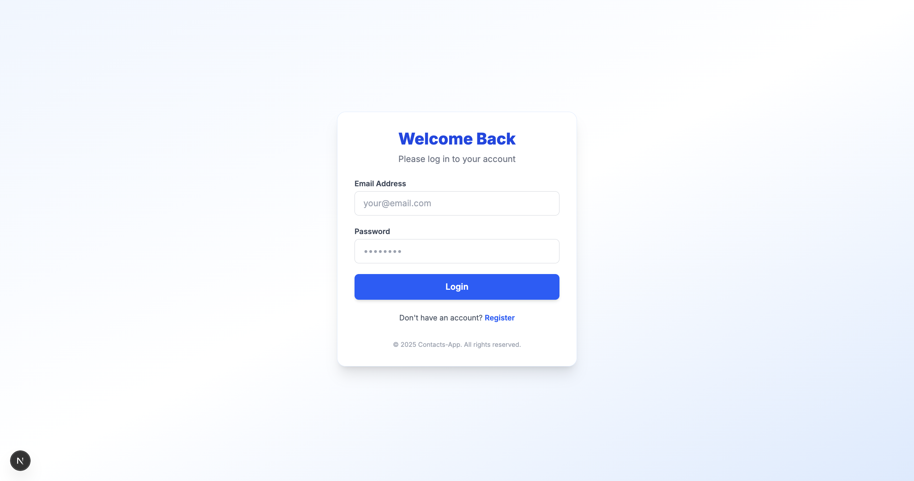
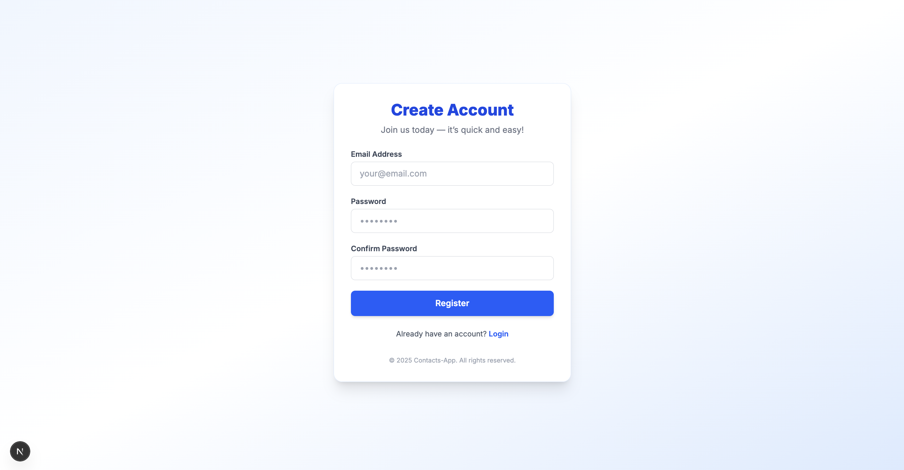
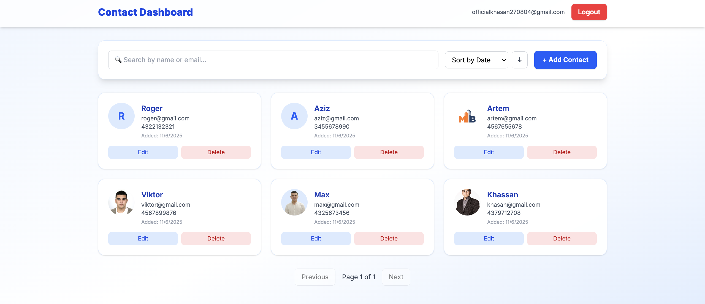
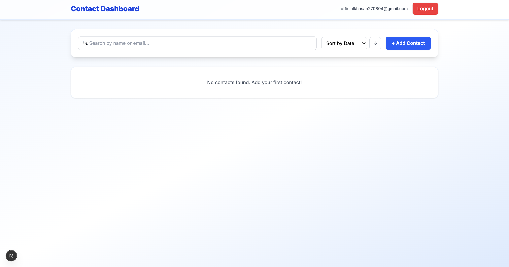
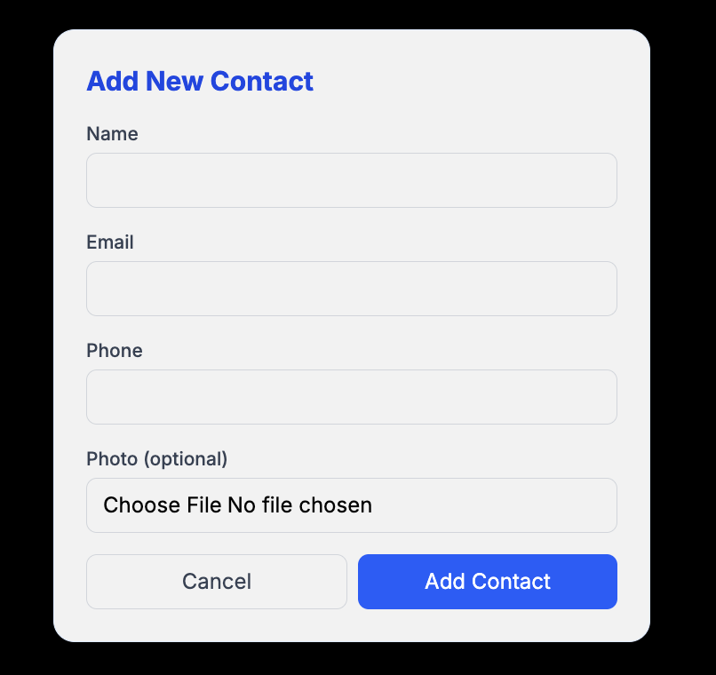
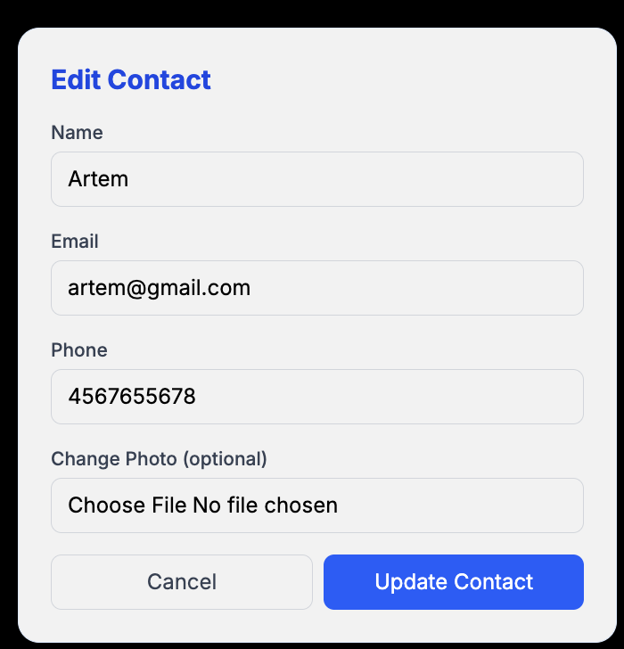
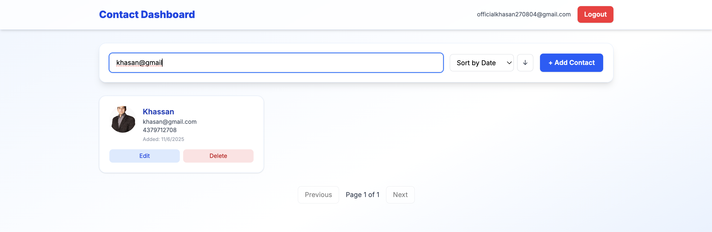
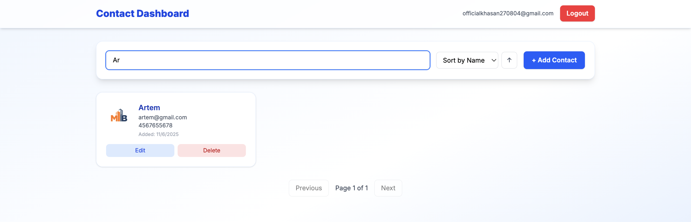

# Contact Management Application

A full-stack contact management app built with Nest.js, Next.js, and PostgreSQL.

## Features

- User authentication (register/login with JWT)
- Full CRUD operations for contacts
- Photo upload for contacts
- Search contacts by name or email
- Sort contacts (by name, email, or date)
- Pagination (10 contacts per page)
- Role-based access (users see only their contacts, admins see all)
- Responsive design with Tailwind CSS

## Tech Stack

**Backend:**
- Nest.js
- TypeORM
- PostgreSQL
- JWT Authentication
- Multer (file uploads)

**Frontend:**
- Next.js 14 (App Router)
- TypeScript
- Tailwind CSS
- Axios
- Context API for state management

## Prerequisites

- Node.js (v18 or higher)
- PostgreSQL (v14 or higher)
- npm or yarn

## Installation

### 1. Clone the repository
```bash
git clone <your-repo-url>
cd contact-management-app
```

### 2. Setup Backend
```bash
cd backend
npm install
```

Create `.env` file in `backend/` folder:
```env
DATABASE_HOST=localhost
DATABASE_PORT=5432
DATABASE_USER=postgres
DATABASE_PASSWORD=your_password
DATABASE_NAME=contact_management
JWT_SECRET=your_super_secret_key_change_this
```

Create PostgreSQL database:
```sql
CREATE DATABASE contact_management;
```

Start backend:
```bash
npm run start:dev
```

Backend will run on: http://localhost:4000

### 3. Setup Frontend
```bash
cd frontend
npm install
```

Start frontend:
```bash
npm run dev
```

Frontend will run on: http://localhost:3000

## Usage

1. Open http://localhost:3000
2. Register a new account
3. Login with your credentials
4. Add, edit, delete, and search contacts
5. Upload photos for your contacts

## API Endpoints

### Authentication
- `POST /auth/register` - Register new user
- `POST /auth/login` - Login user

### Contacts (requires authentication)
- `POST /contacts` - Create contact
- `GET /contacts` - Get all contacts (with pagination, search, sort)
- `GET /contacts/:id` - Get single contact
- `PUT /contacts/:id` - Update contact
- `DELETE /contacts/:id` - Delete contact

## Project Structure
```
contact-management-app/
├── backend/
│   ├── src/
│   │   ├── auth/          # Authentication module
│   │   ├── contacts/      # Contacts module
│   │   ├── entities/      # Database entities
│   │   └── main.ts        # App entry point
│   ├── uploads/           # Uploaded photos
│   └── .env              # Environment variables
├── frontend/
│   ├── app/              # Next.js pages
│   ├── contexts/         # Auth context
│   ├── lib/              # API helper
│   └── components/       # Reusable components
└── README.md
```

## Screenshots

### Authentication
<div style="display: flex; gap: 10px;">
  
  
</div>

### Dashboard
<div style="display: flex; gap: 10px;">
  
  
</div>

### Contact Management
<div style="display: flex; gap: 10px;">
  
  
</div>

### Search & Filter
<div style="display: flex; gap: 10px;">
  
  
</div>

## Future Enhancements

- Export contacts as CSV
- Email notifications
- Dark mode
- Mobile app (React Native)

## Author

Khassan Suleimanov

## License

MIT
